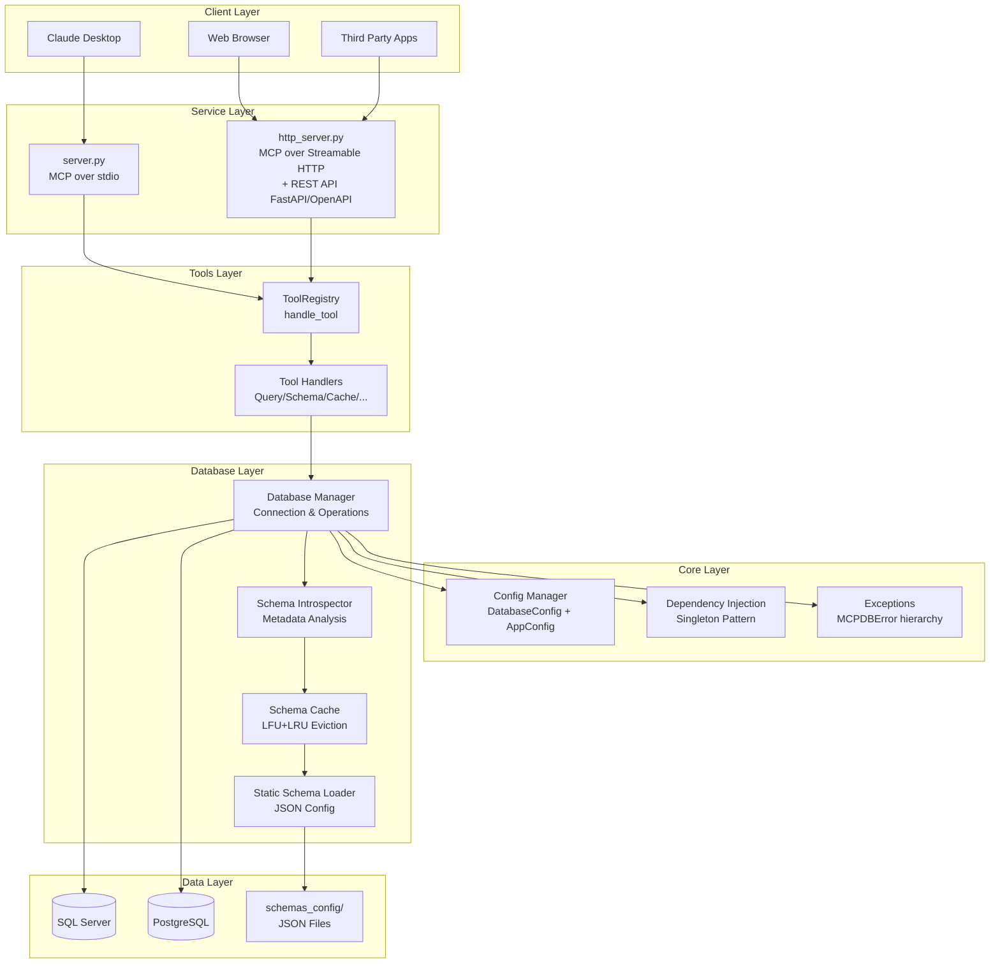
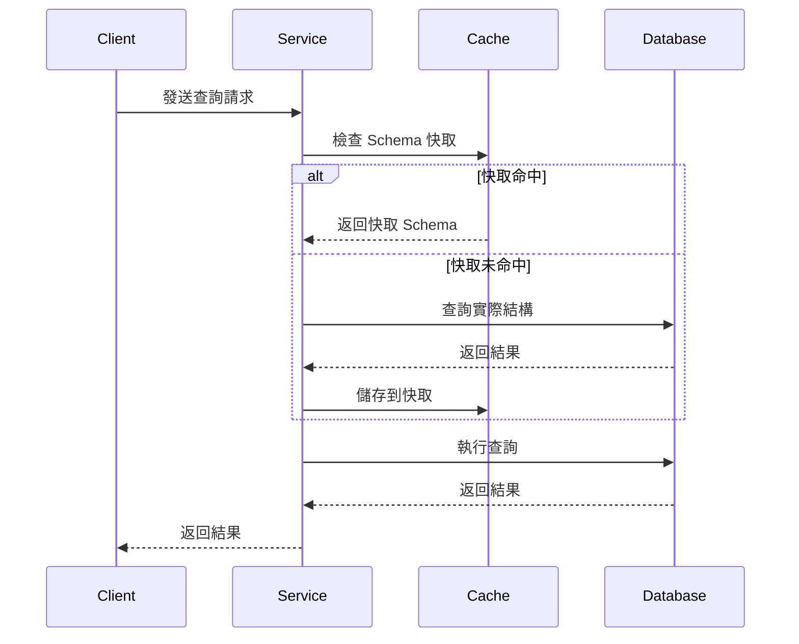
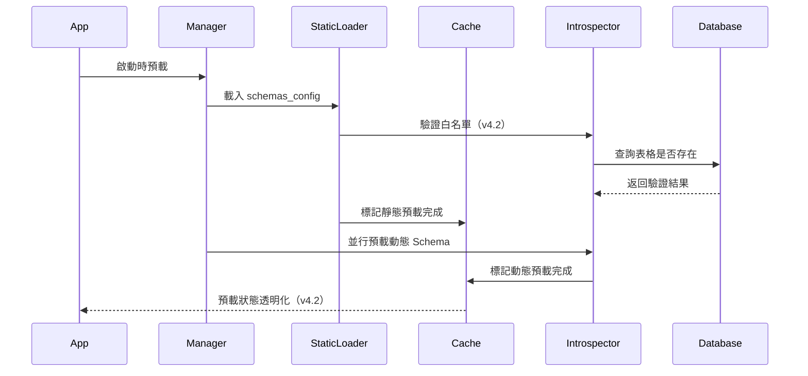
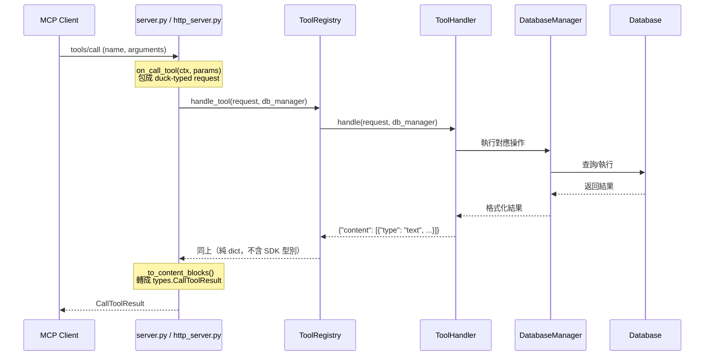

# 🏗️ 系統架構

MCP Multi-Database Connector 採用分層模組化設計，提供靈活且可擴展的多資料庫連接解決方案。本文件詳細說明架構設計、核心模組與資料流程。

## 📊 總體架構



## 設計原則

### 1. 分層架構 (Layered Architecture)
- **核心層 (core/)**: 配置管理、依賴注入、異常處理
- **數據庫層 (database/)**: 連接管理、Schema 快取與內省
- **工具層 (tools/)**: MCP 工具定義、註冊與處理
- **協議進入點**: `server.py`（stdio）與 `http_server.py`（Streamable HTTP + REST）
  各自直接持有一個 SDK `Server` 實例；沒有獨立的協議層套件
- **API 層 (api/)**: 請求／回應模型與中間件（路由定義在 `http_server.py`）

### 2. 兩種進入點
- **stdio（`server.py`）**: 供 Claude Desktop 一類的本機 MCP 客戶端使用
- **HTTP（`http_server.py`）**: 同一個 FastAPI app 同時提供
  - `/mcp` — MCP over **Streamable HTTP**
  - `/api/v1/*` — REST API（OpenAPI/Swagger，供 Open WebUI 與第三方應用整合）
- **統一工具層**: 兩個進入點都經 `ToolRegistry.handle_tool()`，共用同一份工具邏輯

### 3. 關注點分離 (Separation of Concerns)
- 每個層次有明確的職責邊界
- 避免跨層直接依賴
- 通過依賴注入解耦

### 4. 效能最佳化
- **智能快取**: LFU+LRU 混合淘汰策略
- **並行預載**: ThreadPoolExecutor 預載 Schema
- **異步架構**: 支援並發查詢執行

### 5. 通用化設計
- **零硬編碼**: 完全基於 schemas_config 的業務邏輯
- **動態適配**: 自動適應不同資料庫結構
- **可擴展性**: 易於添加新的資料庫支援

---

## 分層架構詳解

### 1️⃣ 核心層 (core/)

#### 📋 config.py
**職責**: 配置管理

```python
class DatabaseConfig:
    """資料庫連接配置"""
    db_type: str        # mssql | postgresql
    host: str
    port: int
    database: str
    username: str
    password: str
    trust_server_certificate: bool

class SchemaConfig:
    """Schema 系統配置"""
    enable_cache: bool
    cache_ttl_minutes: int
    enable_static_preload: bool
    strict_mode: bool

class AppConfig:
    """應用程式配置"""
    expose_sensitive_info: bool
    max_concurrent_queries: int
    query_timeout_seconds: int
```

#### 🔌 dependencies.py
**職責**: 依賴注入（單例模式）

```python
# 單例模式的配置管理器
def get_app_config() -> AppConfig
def get_database_config() -> DatabaseConfig

# 單例模式的數據庫管理器
def get_database_manager() -> DatabaseManager
```

#### ⚠️ exceptions.py
**職責**: 自定義異常

```python
class MCPDBError(Exception)              # 基礎異常
class ToolExecutionError(MCPDBError)     # 工具執行錯誤
class SchemaLoadError(MCPDBError)        # Schema 載入錯誤
class DatabaseConnectionError(MCPDBError)  # 連接錯誤
class ConfigurationError(MCPDBError)     # 配置錯誤
class QueryExecutionError(MCPDBError)    # 查詢執行錯誤
class CacheError(MCPDBError)             # 快取錯誤
```

> `core/error_handling.py`（`format_error_response` / `safe_execute`）已於
> 2026-08-04 移除 —— 它從未被任何進入點載入（死碼）。錯誤格式化實際發生在
> `tools/base.py` 的 `_error_response()` 與各進入點的 except 區塊。

---

### 2️⃣ 數據庫層 (database/)

#### 🗄️ manager.py - DatabaseManager
**職責**: 統一的資料庫管理入口

```python
class DatabaseManager:
    """資料庫連接和操作管理"""

    def __init__(config: DatabaseConfig, app_config: AppConfig)

    # 連接管理
    def get_connection()  # 上下文管理器
    def test_connection()

    # 查詢執行
    def execute_query(query: str, params: List = None)
    def execute_command(command: str, params: List = None)

    # Schema 操作
    def get_schema_info(table_name: Optional[str] = None)
    def get_table_dependencies(table_name: str)
    def get_schema_summary()

    # 快取管理
    def invalidate_schema_cache(table_name: Optional[str] = None)
```

#### 🔌 connectors.py
**職責**: 資料庫連接器

```python
def create_database_connector(config: DatabaseConfig)

class MSSQLConnector(DatabaseConnector):
    """SQL Server 連接器"""

class PostgreSQLConnector(DatabaseConnector):
    """PostgreSQL 連接器"""
```

#### 📊 database/schema/ 子系統

##### cache.py - SchemaCache
**職責**: Schema 快取系統（LFU+LRU）

```python
class SchemaCache:
    """智能快取 - LFU+LRU 混合淘汰"""

    def __init__(max_size: int, default_ttl: int)

    # 基本操作
    def get(key: str) -> Optional[Any]
    def set(key: str, value: Any, ttl: Optional[int] = None)
    def invalidate(pattern: str = None) -> int

    # 預載追蹤 (v4.2 新增)
    def mark_static_preload_complete(table_names: List[str])
    def mark_dynamic_preload_complete(table_names: List[str])
    def get_preload_status() -> Dict[str, Any]
    def is_table_preloaded(table_name: str) -> Dict[str, bool]

    # 統計
    def get_stats() -> Dict[str, Any]
```

**特點**：
- ⏱️ TTL (Time To Live) 自動過期
- 📈 LFU+LRU 混合淘汰策略
- 📊 快取命中率統計
- 🔍 預載狀態透明化（v4.2）

##### introspector.py - SchemaIntrospector
**職責**: 資料庫內省（查詢實際結構）

```python
class SchemaIntrospector:
    """資料庫 Schema 分析器"""

    def get_schema_info(table_name: str = None) -> Dict[str, Any]
    def get_table_dependencies(table_name: str) -> Dict[str, Any]
    def export_table_schema(table_name: str, output_dir: str) -> str
    def get_schema_summary() -> Dict[str, Any]
```

##### static_loader.py - StaticSchemaLoader
**職責**: JSON 配置載入

```python
class StaticSchemaLoader:
    """靜態 Schema 載入器（JSON 配置）"""

    def load_schemas_config() -> Dict[str, Any]
    def get_table_schema(table_name: str) -> Optional[Dict]
    def validate_whitelist(introspector: SchemaIntrospector)  # v4.2 新增
```

##### formatter.py
**職責**: Schema 格式化（用於顯示）

---

### 3️⃣ 工具層 (tools/)

#### 📖 definitions.py
**職責**: 工具定義（`Tool` 清單）與名稱前綴

```python
def get_tool_prefix() -> str      # 讀 TOOL_PREFIX 環境變數，預設 "db"
def make_tool_name(suffix) -> str  # "query" -> "{prefix}_query"
def get_all_tools() -> List[Tool]  # 全部工具定義
DB_TOOLS: List[Tool]               # 同上，模組載入時求值
```

**工具清單**（11 支，實際名稱依 `TOOL_PREFIX` 而定）：

| suffix | 說明 |
|--------|------|
| `query` | 執行 SQL 查詢 |
| `schema` | 取得 Schema 資訊 |
| `schema_summary` | Schema 摘要 |
| `schema_reload` | 重載 Schema |
| `static_schema_info` | 靜態 Schema 配置資訊 |
| `export_schema` | 匯出 Schema |
| `dependencies` | 分析表格依賴關係 |
| `test_connection` | 測試資料庫連接 |
| `cache_stats` | 快取統計 |
| `cache_invalidate` | 清除快取 |
| `syntax_guide` | SQL 語法指引 |

#### 🎛️ registry.py - ToolRegistry
**職責**: 把工具呼叫路由到對應的 handler

```python
class ToolRegistry:
    def __init__(self)
        """建立所有 handler 實例，並以 tool_name -> handler 建索引"""

    async def handle_tool(self, request, db_manager) -> Dict[str, Any]
        """統一的工具處理入口（兩個進入點共用）"""
```

handler 清單（`tools/handlers/`）：`QueryHandler`、`ConnectionHandler`、
`DependencyHandler`、`SchemaHandler`、`CacheHandler`、`ExportHandler`、`SyntaxHandler`。

#### 🧱 base.py - ToolHandler
**職責**: handler 抽象基底與統一回應格式

```python
class ToolHandler(ABC):
    tool_names: List[str]                       # 本 handler 負責的工具名
    async def handle(self, request, db_manager)  # 實作工具邏輯
    def _success_response(self, text) -> dict
    def _error_response(self, error_message) -> dict   # 帶 isError: True
```

> **協議／業務分界線就在這裡。** `handle_tool()` 收到的 `request` 只被讀取
> `.name` 與 `.arguments` 兩個屬性，因此 handler 完全不依賴 SDK 型別 ——
> SDK v2 的欄位改名（`inputSchema` → `input_schema`）不會滲進業務邏輯。
>
> 注意 `_error_response()` 產生的 `isError: True` **目前未被協議層取用**：
> 並非每個 handler 都走這個方法回報失敗（有些自行組錯誤文字後當成功回傳），
> 直接接上 `CallToolResult.is_error` 會讓失敗語意不一致。原因與後續處理見
> 主專案 `docs/mcp-2026-07-28-migration/ISSUES.md`。

---

### 4️⃣ 協議進入點

| 模式 | 指令 | 對外提供 | 用途 |
|------|------|---------|------|
| STDIO | `python -m server` | MCP over stdio | Claude Desktop / Claude Code |
| HTTP | `python -m http_server` | `/mcp`（Streamable HTTP）+ `/api/v1/*`（REST）| Open WebUI / MCPO / 第三方 |

**沒有獨立的協議層套件。** 原先的 `src/protocol/`（`base_server.py` /
`stdio_server.py` / `sse_server.py`）與 `src/main.py` 已於 2026-08-04 移除 ——
它們是死碼，兩個容器的 CMD 就是上表的指令，從未經過 `main.py`。
協議處理現在直接寫在兩個進入點裡。

> 兩個進入點各自建立自己的 `Server` 實例與 handler。這是**複製關係而非共用** ——
> 改動其中一邊的協議行為時必須手動同步另一邊（協議層測試只覆蓋 HTTP 側）。

#### 🖥️ server.py — stdio 進入點

```python
# SDK v2 移除了 decorator API，handler 改為建構參數
server = Server(
    server_name,
    on_list_tools=on_list_tools,
    on_call_tool=on_call_tool,
    on_list_prompts=on_list_prompts,
    on_list_resources=on_list_resources,
)

async with server.lifespan(server) as lifespan_state:
    async with stdio_server() as (read_stream, write_stream):
        # 同時服務 initialize handshake 世代與無狀態的 2026-07-28 世代
        await serve_dual_era_loop(
            server, read_stream, write_stream, lifespan_state=lifespan_state
        )
```

#### 🌐 http_server.py — MCPHTTPServer（Streamable HTTP + REST）

```python
class MCPHTTPServer:
    def __init__(self, config: Optional[DatabaseConfig] = None):
        self.mcp_server = Server(..., cache_hints=cache_hints, on_list_tools=..., ...)

        # stateless=True 對應 2026-07-28 的無狀態模型，同時保留 handshake 世代
        # json_response=True → 回應是 application/json，不是 text/event-stream
        self.session_manager = StreamableHTTPSessionManager(
            app=self.mcp_server, stateless=True, json_response=True
        )

        self.app = FastAPI(..., lifespan=lifespan)   # lifespan 內 run session manager
        self.app.mount("/mcp", mcp_asgi_app)          # MCP 端點
        setup_middleware(self.app, app_config)
        self._register_routes()                        # REST 端點
```

**Transport**：**Streamable HTTP**，端點 `/mcp`。已取代舊的 SSE 傳輸，
`/sse/` 不再存在（會回 404）。

**兩個協議世代並存**：同一個 `/mcp` 端點同時服務

| 世代 | 特徵 | 目前誰在用 |
|------|------|-----------|
| handshake 世代（≤ 2025-11-25） | 先 `initialize` 再送請求 | MCPO |
| 2026-07-28 世代 | 無 handshake，self-contained POST；必須帶 `Mcp-Method`（呼叫工具時另帶 `Mcp-Name`）與 `params._meta` 信封 | 尚無生產客戶端 |

世代判別由 SDK 的 `StreamableHTTPSessionManager` 處理，模組不自行協商版本。

**SEP-2549 快取提示**：`Server(cache_hints=...)` 對 `tools/list`、`prompts/list`、
`resources/list` 宣告 `ttlMs` / `cacheScope`。TTL 由 `MCP_LIST_CACHE_TTL_SECONDS`
控制（預設 300 秒），**刻意不與 `SCHEMA_CACHE_TTL_MINUTES` 綁定** —— 後者是伺服器端
快取、可隨時清除；前者是客戶端快取、無法遠端失效，所以它的值等於最壞情況的過期視窗。
`scope` 為 `private`，因為工具描述內嵌了各部署自己的表格白名單。

---

### 5️⃣ API 層 (api/)

#### 🛣️ REST 端點（定義於 `http_server.py` 的 `_register_routes()`）

```python
GET  /api/v1/health                    # 健康檢查
GET  /api/v1/tools                     # 工具列表
GET  /api/v1/connection/test           # 測試資料庫連線
POST /api/v1/query                     # 執行查詢
GET  /api/v1/schema                    # Schema 資訊
GET  /api/v1/schema/{table_name}       # 單一表格 Schema
GET  /api/v1/dependencies/{table_name} # 表格依賴關係
GET  /api/v1/summary                   # Schema 摘要
GET  /api/v1/database/info             # 資料庫資訊
GET  /api/v1/cache/stats               # 快取統計
GET  /api/v1/admin/cache-debug         # 快取除錯
POST /api/v1/cache/invalidate          # 清除快取
POST /api/v1/schema/reload             # 重載 Schema
GET  /api/v1/schema/static/info        # 靜態 Schema 配置資訊
```

> 原先的 `api/routes.py`（`APIRouter`）已移除；路由改為在 `MCPHTTPServer`
> 內註冊，因為它們需要存取實例上的 `db_manager` 與 `tool_registry`。
>
> **錯誤語意**：REST 層的業務錯誤一律回 **HTTP 200**，錯誤訊息放在
> body 的 `{"success": false, "error": ...}`。僅參數格式錯誤等會回 4xx。

#### 📦 models.py
**職責**: 請求／回應模型（Pydantic）— `QueryRequest`、`CacheInvalidateRequest`、`HealthResponse`

#### 🎨 middleware.py
**職責**: 中間件配置

```python
def setup_middleware(app: FastAPI, app_config: AppConfig):
    """CORS、GZip、限流"""
```

CORS 的 `allow_headers` 必須放行 MCP 2026-07-28（SEP-2243）要求的
`Mcp-Method`、`Mcp-Name`、`MCP-Protocol-Version`、`Mcp-Session-Id` ——
否則瀏覽器端 MCP 客戶端的 preflight 會被擋（實測回 400）。
經 MCPO 進來的是 server-to-server 請求，不受此影響。

---

## schemas_config Customization Architecture

### Three-Layer Knowledge Injection

```
schemas_config/
├── global_patterns.json     # Global pattern matching
│   ├── _ID$ → "Identifier"
│   ├── _DATE$ → "Date"
│   └── _AMT$ → "Amount"
│
├── tables/*.json            # Table business logic
│   ├── Column descriptions
│   ├── Status value definitions
│   ├── Key field markers
│   └── Common query scenarios
│
├── ai_enhancement.json      # AI enhancement config
│   ├── Keyword mappings
│   ├── Query pattern templates
│   └── Optimization hints
│
└── tables_list.json         # Main configuration
```

### Benefits
- **60-80% token savings**: Compressed Schema descriptions
- **90%+ first-query accuracy**: AI generates correct SQL directly
- **Millisecond responses**: Dual-layer cache (dynamic TTL + static JSON)

---

## 📊 資料流程

### 1. 查詢執行流程



### 2. Schema 載入流程（v4.2 改進）



### 3. MCP 工具調用流程



> SDK v2 不再自動包裝 handler 的回傳值，因此 `_to_content_blocks()` 這道轉換
> 是必要的；把它留在進入點是刻意的設計，讓 `ToolRegistry` 之下完全不碰 SDK 型別。

---

## 🚀 效能考量

### 1. 快取策略（v4.2 改進）
- **LFU+LRU 混合淘汰**: 結合訪問頻率和最近使用
- **TTL 自動過期**: 可配置的過期時間
- **預載優化**: 啟動時並行預載熱門 Schema
- **預載追蹤**: 透明的預載狀態查詢（v4.2）

### 2. 異步架構（階段 1+2 完成）
- **AsyncDatabaseManager**: 異步查詢執行
- **HybridDatabaseManager**: 雙介面（同步+異步）
- **並發查詢**: 支援多個同時查詢（最大 5 個）
- **連接池**: 異步連接池管理

### 3. 智能優化
- **Schema 壓縮**: 60-80% token 節省
- **Strict Mode**: 僅允許預配置表格，防止意外查詢
- **來源追蹤**: cache_source 字段標記數據來源（v4.2）

---

## 🔒 安全性架構

### 1. 資料庫安全
- **最小權限**: 僅授予 SELECT 權限（只讀模式）
- **參數化查詢**: 防止 SQL 注入攻擊
- **SQL 驗證**: 拒絕 DELETE/DROP/INSERT 等危險語句
- **連線加密**: 支援 SSL/TLS 加密連線

### 2. API 安全
- **輸入驗證**: Pydantic 模型驗證
- **錯誤處理**: 統一錯誤格式，避免敏感資訊洩露（v4.2）
- **CORS 配置**: 可配置的跨域存取控制
- **敏感資訊保護**: `expose_sensitive_info` 控制（v4.2）

### 3. 配置安全
- **環境變數**: 使用 .env 存儲敏感資訊
- **JSON 配置**: schemas_config 不包含密碼
- **日誌安全**: 自動過濾 server/port/driver 資訊

---

## 🔄 擴展性設計

### 1. 新資料庫支援
```python
# 添加新的資料庫類型
class NewDatabaseConnector(DatabaseConnector):
    def get_connection(self) -> Any
    def execute_query(self, query: str) -> List[Dict]
    def get_schema_info(self, table_name: str) -> Dict
```

### 2. 新 MCP 傳輸層支援

傳輸層由 SDK 提供，模組不自行實作。新增一種傳輸＝把同一個 `Server` 實例
交給 SDK 對應的 transport，handler 完全不用改：

```python
# 既有：stdio（server.py）
async with stdio_server() as (r, w):
    await serve_dual_era_loop(server, r, w, lifespan_state=state)

# 既有：Streamable HTTP（http_server.py）
StreamableHTTPSessionManager(app=server, stateless=True, json_response=True)
```

### 3. 新工具支援
```python
# 1) 在 tools/definitions.py 加入 Tool 定義
new_tool = Tool(
    name=make_tool_name("new_feature"),   # 自動套用 TOOL_PREFIX
    description="...",
    inputSchema={"$schema": "https://json-schema.org/draft/2020-12/schema", ...},
)

# 2) 在 tools/handlers/ 實作 ToolHandler 子類別，並加進
#    tools/registry.py 的 handler_classes 清單
```

> **`inputSchema` vs `input_schema`**：SDK v2 的 Python 屬性名是 `input_schema`，
> 但 `Tool.model_config` 設了 `populate_by_name=True`，所以建構時寫
> `inputSchema=` 仍然可用，且**傳輸線上的欄位名一直是 camelCase 的
> `inputSchema`**。JSON Schema 依 SEP-2106 應宣告 2020-12 版本。

---

## 📈 監控和維護

### 1. 健康檢查
```python
@app.get("/health")
async def health_check():
    return {
        "status": "healthy",
        "database": await db_manager.test_connection(),
        "cache": cache.get_stats(),
        "preload_status": cache.get_preload_status(),  # v4.2
        "timestamp": datetime.now().isoformat()
    }
```

### 2. 快取監控
```python
cache.get_stats()
# {
#     "size": 50,
#     "max_size": 100,
#     "hit_rate": 0.85,
#     "total_hits": 1200,
#     "total_misses": 200
# }
```

### 3. 預載狀態（v4.2 新增）
```python
cache.get_preload_status()
# {
#     "static_preload_completed": True,
#     "dynamic_preload_completed": True,
#     "static_tables_count": 10,
#     "dynamic_tables_count": 15,
#     "total_tables": 25,
#     "preload_timestamp": "2025-12-30T10:30:00"
# }
```

---

## 架構設計總結

### 關鍵改進
1. ✅ **分層架構** - 清晰的職責劃分（core / database / tools / api + 兩個進入點）
2. ✅ **Strict Mode 改進** - cache_source 來源追蹤
3. ✅ **預載邏輯同步** - 預載狀態透明化
4. ✅ **白名單驗證** - 靜態 Schema 驗證是否存在於資料庫
5. ✅ **Streamable HTTP + 兩世代並存** - 同一 `/mcp` 端點服務 handshake 世代與 2026-07-28
6. ✅ **CORS 放行 MCP headers** - `Mcp-Method` / `Mcp-Name` / `MCP-Protocol-Version`
7. ✅ **依賴注入** - 單例模式的配置和管理器
8. ✅ **優雅關閉** - 自動清理資源
9. ✅ **收斂死碼** - 移除 `protocol/`、`main.py`、`api/routes.py`、`core/error_handling.py`，
   每個模組從 3 套平行的 MCP handler 收斂為 1 套

---

> **相關文件**：
> - [v4.2 架構重構詳解](development/v4.2-architecture-refactoring.md)
>   — **歷史文件**，描述 2026-01 當時的分層（含已移除的 `protocol/`）
> - [Schema 系統](schema-system.md) — schemas_config 配置系統
> - [效能優化](performance.md) — 快取與 Token 優化策略
> - [測試指南](testing.md) — 單元測試與覆蓋率報告
> - 主專案 `docs/mcp-2026-07-28-migration/` — 本次協議遷移的完整紀錄、決議與已知未修項

**最後更新**：2026-08-04（MCP 2026-07-28 協議遷移：Streamable HTTP、SDK v2、死碼收斂）
**版本**：v1.1.0
